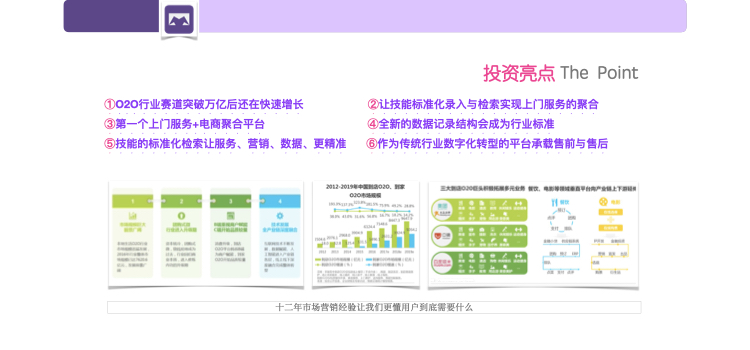
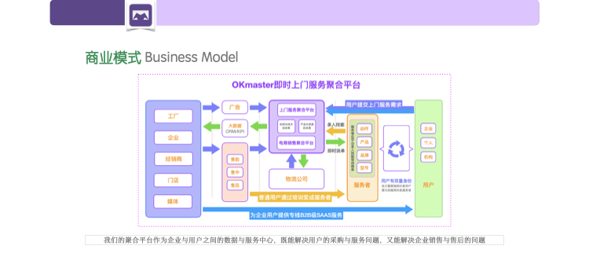

### 
 **OKmaster商业计划书 Ⅰ** 

- 投资亮点 The  Point
- 公司使命 Company Purpose
- 市场空间 Market Potential
- 时机 Why Now
- 市场痛点 Problem
- 解决方案 Solution<!--more-->

**投资亮点 The  Point**

  - ①O2O行业赛道突破万亿后还在快速增长
  - ②让技能标准化录入与检索实现上门服务的聚合
  - ③第一个上门服务+电商聚合平台
  - ④全新的数据记录结构会成为行业标准
  - ⑤技能的标准化让服务、营销、数据、更精准
  - ⑥作为传统行业数字化转型的平台承载售前与售后

**公司使命 Company Purpose**

依托上门服务承载产品销售与服务销售两个职能把上门服务时效再提升一倍。
帮助更多人就业，共建一小时经济圈。
两个版本注册用户超1000人，正式版注册用户数量575人，全部为电影院经理、工程师、影院老板。

**市场空间 Market Potential**

我们的市场空间为（O2O上门+电商+CRM）X 5%=1250亿元。
2017年生活服务O2O市场规模为9992亿元（前瞻研究院）。
2018年我国生活服务电商交易规模达1.4979万亿元（央广网）。
2019年SAAS CRM市场规模将超60亿（金融界）。

**时机 Why Now?**

就业问题是未来所有人都要正视的问题，
互联网时代对服务时效有了更高的要求。

**市场痛点 Problem**

上门服务还没有跨行业聚合平台，
不能标准化的录入与检索一个人的技能，
用户不会无限制的下载软件来满足同一类型的需求，服务商不能有效管理在很多平台记录的服务内容。

**解决方案 Solution**

用标准格式录入与检索一个人的技能实现跨行业快速匹配，
让上门服务聚合平台成为现实。

### 
**OKmaster商业计划书 Ⅱ**

- 商业模式 Business Model
- 竞争态势 Cometition / Alternatives
- 团队 Team
- 财务预测 Financials
- 联系我们 Contact Us

**商业模式 Business Model**

以上门服务聚合平台做为一个流量入口，
有派单分成，商品销售和广告收入还有入驻佣金收入。
作为商品销售与技能服务的平台，我们能实现上门服务与电商的超级聚合。
我们与第三方销售商与服务商合作，在我们的平台按标准化录入销售或服务技能。
用户可以付费或者申请成为会员在附近找到服务者提供上门服务。
第三方企业端需要营销并对销售数据及客户数据做有效管理。

**商业模式 Business Model**

**市场反馈 Project Overview**

维修工程师对软件认可度非常高，
已经有两家售后服务商表达浓厚合作兴趣。

**竞争态势 Cometition / Alternatives**

标准化的技能录入与检索和当前其它平台的数据结构不一样，**我们是唯一的**
潜在的竞争对手可能是滴滴、美团、58到家、阿里到位、UBER、百度糯米、脉脉、跑腿类
我们与其它平台的主要区别是更清晰的描述一条技能，从而开启与电商的聚合。

**财务预测 Financials**

初期融资规模大约3,000,000/10%(研发团队8人，营销团队3人，运营团队6人，广告投放与行业展会曝光)。
主要用于软件研发迭代与市场营销团队搭建及针对性的广告投放。
我们的价值是为企业用户与个人用户提供数据中控台，所以软件的研发与数据安全非常重要，建立一个可靠的研发团队是必不可少的。
市场营销方面会着重先打通一个行业，然后再慎重扩展到其它高频业务，比如搬家、保洁、家政、医护、出行等。