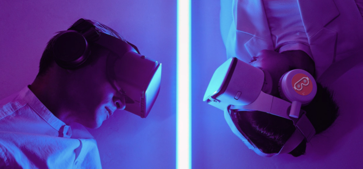

### 在虚拟中复刻现实，从现实中创建未来！

***我们将在虚拟与现实之间架起一座桥梁，连通现在与未来。***
元宇宙是一条通向虚拟与现实的双向构建之路， 非常荣幸与各位领袖一起见证元宇宙的未来！

有分享才有收获！在这里我们将一起分享在虚拟中复刻现实，从现实中洞见未来的喜悦,让我们共同见证元宇宙的未来!希望在这个元宇宙项目中能为大家提供一个交流机会，在市场风险与机遇中提供投资参考，让未来逐渐清晰。

**我们的元宇宙项目分为以下四个板块：**

- 虚拟现实-分享虚拟世界与现实世界创造与体验过程中有关政策支持、软件创新、VR游戏交流和硬件穿戴的评测等内容。

- 数字货币-分享数字货币的国际动向和影响国际金融状态的重要决策，包括数字人民币应用普及、知名加密货币相关企业的投融资进展，以及世界知名投资基金的最新投资等。

- 数字藏品-分享NFT数字藏品的最新动态及创新的行业应用。

- 创建WEB3-分享第三代互联网建设的最新动态。包含区块链创新应用、芯片迭代、云计算动态、5G移动网络普及、星链建设与应用进展等元宇宙基础设施构建的内容。

**[元宇宙中所有平行的世界，最终都只是同一个世界的投影](https://www.toutiao.com/article/7012976151521935910/?log_from=bd1eb8dc7c2a4_1661091805301)**

